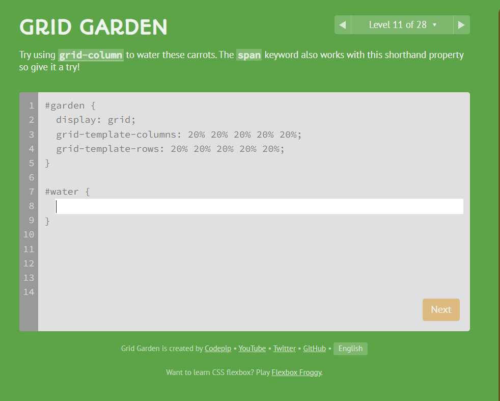
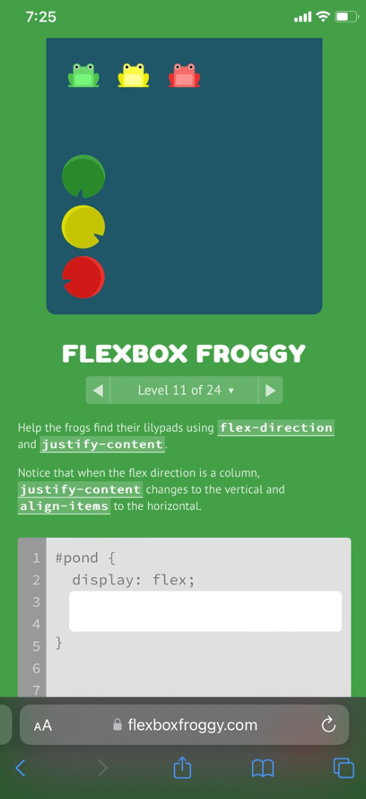

# flex-grid

In this task we applied  5 exercises , the first and second exercise we play a game and achieved a specified level (at least 10),the last 3 exercise we design a screens by using CSS , the main idea of these exercises is --> grid and flex 

